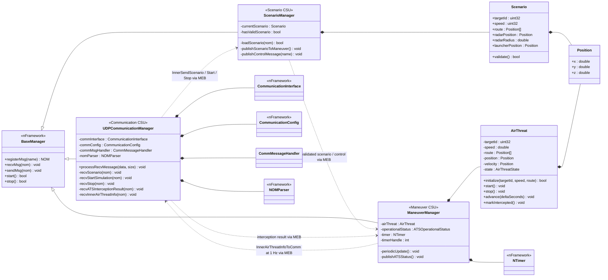

# ATS 프로젝트 아키텍처

## 구성 원칙

- 외부 UDP 통신은 기존 `UDPCommunicationManager`가 전담한다.
- `ScenarioManager`는 수신 시나리오의 파싱, 검증, 보관과 기동 명령 전달을 담당한다.
- `ManeuverManager`는 공중위협 객체의 생명주기와 기동 계산을 담당한다.
- `ManeuverManager`는 플러그인 시작 후 1초마다 내부 상태 메시지를 발행한다.
- `UDPCommunicationManager`는 내부 상태 메시지를 ICD의 `ATSStatus(0x02)`로 변환해 전송한다.
- 매니저 사이에는 직접 C++ 호출을 사용하지 않고 nFramework MEB/NOM 메시지만 사용한다.
- 기존 `StateManager`의 `SimulatorState(0x0B)` 하트비트는 실행 설정에서 비활성화한다.
- `UDPCommunicationManager.xml`은 변경하지 않는다.

## 클래스 다이어그램

## 메시지 흐름

1. 운용통제기에서 `Scenario(0x01)`를 UDP로 전송한다.
2. `UDPCommunicationManager`가 외부 메시지를 `InnerSendScenario(0x21)`로 변환한다.
3. `ScenarioManager`가 표적 ID, 속도, 최대 8개 경로점을 검증한 후 `InnerSendScenarioToModel(0x23)`을 발행한다.
4. `ManeuverManager`가 `AirThreat`를 초기화한다.
5. `StartSimulation(0x06)`은 내부 시작 메시지를 거쳐 `AirThreat::start()`를 호출한다.
6. `ManeuverManager`의 1 Hz 타이머가 위치를 갱신하고 `InnerAirThreatInfoToComm(0x41)`을 발행한다.
7. `UDPCommunicationManager`가 이 메시지를 `ATSStatus(0x02)`로 변환해 운용통제기에 전송한다.
8. `ATSInterceptionResult(0x0E)` 수신 시 현재 표적을 요격 상태로 전환하고 다음 상태 주기에 반영한다.

## 상태 값

| 값 | 상태 | 의미 |
|---:|---|---|
| 0 | IDLE | 플러그인 종료 또는 초기화 전 |
| 1 | READY | UDP/매니저 시작 완료, 시작 명령 대기 |
| 2 | RUNNING | 시나리오 기동 수행 중 |

## 실제 프로젝트 이름과 설계 클래스 이름

nFramework의 기존 DLL 로딩 설정을 유지하기 위해 프로젝트 컨테이너와 출력 DLL 이름은 당분간 다음처럼 유지한다.

| 기존 프로젝트/DLL | 실제 구현 클래스 | 역할 |
|---|---|---|
| `UDPCommunicationManager` | `UDPCommunicationManager` | 외부 UDP 통신 |
| `ScenarioManager` | `ScenarioManager` | 시나리오 관리 |
| `ManeuverManager` | `ManeuverManager` | 공중위협 기동/상태 관리 |

이 방식은 DLL 경로 변경으로 인한 플러그인 로딩 실패를 피하면서 내부 설계를 목표 클래스 구조로 전환한다.
